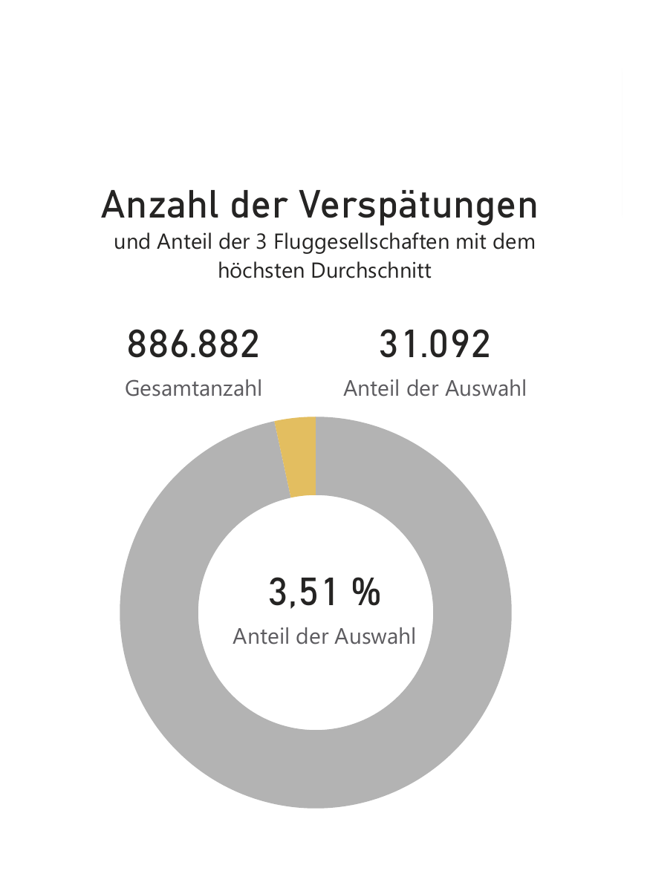

# fLAirport — Analyse unpünktlicher Flüge

**Unpünktlichkeit am Los Angeles International Airport (LAX), 2015–2017 — 1.264.229 Flüge, 13 Fluggesellschaften, aufbereitet für Führungskräfte-Reporting.**


---

## TL;DR

- **1.264.229** Flüge von/nach LAX (2015–2017) analysiert — **70 %** davon unpünktlich
  (≥ 5 Min. Abweichung, zu früh oder zu spät)
- **On-Time Performance: 29,85 %** · **Ø Verspätung: 26,42 Min./Flug** · **Delay Index: 18,54**
- Die drei Airlines mit der höchsten *durchschnittlichen* Verspätung pro Flug
  (Envoy Air, Frontier Airlines, JetBlue Airways) stehen nur für **3,51 %** aller Verspätungen —
  zentrales Finding: der Indikator "Ø-Verspätung pro Flug" ist für Priorisierung ungeeignet
- Klare saisonale (Q2-Anstieg, Q3-Peak) und wöchentliche Muster (Samstag = Minimum, Freitag/
  Montag = Anstieg) sowie Tagesmuster (Peaks morgens 6–9 Uhr und am späten Nachmittag)


*Die drei Airlines mit der schlechtesten Durchschnittsverspätung tragen nur 3,51 % zur Gesamtverspätung bei — der naheliegende Indikator täuscht.*

---

## Where to start

| Du bist… | Start hier |
| :--- | :--- |
| Neu im Projekt / schneller Überblick | [Hub](public/index.html) — Kennzahlen + Navigation zu allen Ansichten |
| Auf der Suche nach der Business-Story | [Overview](public/overview.html) — verdichtete Kennzahlen & Empfehlungen |
| Willst den vollständigen Report | [StoryView](public/storyview.html) — 1:1 zum Original-Report, inkl. Anhang |
| Technisch interessiert (SQL/DAX/M) | [TechView](public/techview.html) — Deep-Dive, SQL/DAX-Formeln folgen |
| Willst den Original-Report | [`report/Report-flAirport_v09.pdf`](report/Report-flAirport_v09.pdf) |

---

## Table of Contents

- [Project Overview](#project-overview)
- [Problem Statement](#problem-statement)
- [Dataset](#dataset)
- [Approach](#approach)
- [Results](#results)
- [Reports & Artifacts](#reports--artifacts)
- [Tech Stack](#tech-stack)
- [Setup](#setup)
- [Author](#author)

---

## Project Overview

Der Flughafenbetreiber fLAirport möchte für sein größtes Drehkreuz, den Los Angeles
International Airport, einen abteilungsübergreifenden Bericht zur Flugpünktlichkeit — als
gemeinsame Diskussionsgrundlage für Führungskräfte. Die Analyse deckt Übersichtskennzahlen, die
unpünktlichsten Airlines und zeitliche Muster ab, getrennt nach Abflug und Ankunft.

Umgesetzt als **Power BI Business Intelligence Case** (StackFuel Abschlussprojekt):
SQL-Query gegen eine PostgreSQL-Datenbank → Power Query/DAX-Aufbereitung → interaktiver Report
→ 15-minütige Management-Präsentation.

| Phase | Werkzeug | Wo |
| :--- | :--- | :--- |
| Daten sammeln | SQL (PostgreSQL) | Filter: 2015–2017, LAX, keine gestrichenen/umgeleiteten Flüge |
| Daten bereinigen | Power Query (M) | Zeitformat `hhmm`, Sonderfall `2400`, Airline-Klarnamen via CSV |
| Analyse | DAX Measures | Kennzahlen, Top-3-Airlines, zeitliche Ebenen (Jahr–Stunde) |
| Storytelling | Power BI Report + Portfolio-Pipeline | [Hub](public/index.html) · [`report/Report-flAirport_v09.pdf`](report/Report-flAirport_v09.pdf) |

---

## Problem Statement

Wie pünktlich ist der Flugverkehr an LAX, welche Airlines stechen negativ hervor, und lassen
sich wiederkehrende Zeiträume mit gehäufter Unpünktlichkeit identifizieren — um interne Prozesse
gezielt darauf abstimmen zu können?

| KPI | Ist | Ziel | Gap |
| :--- | :--- | :--- | :--- |
| On-Time Performance | 29,85 % | höher, saisonal geglättet | — |
| Ø Verspätung/Flug | 26,42 Min. | reduzieren, v. a. in Peak-Zeiträumen | — |

Ein Flug gilt als unpünktlich ab 5 Minuten Abweichung von der geplanten Zeit — in beide
Richtungen (zu früh wie zu spät). Betrachtet werden ausschließlich Flüge von oder nach LAX,
gestrichene und umgeleitete Flüge sind ausgeschlossen.

---

## Dataset

| Property | Value |
| :--- | :--- |
| Quelle | PostgreSQL-Datenbank `Flight_Data`, Tabelle `flights` (StackFuel-Trainingsumgebung, Zugang nicht öffentlich) + [`data/UNIQUE_CARRIERS.csv`](data/UNIQUE_CARRIERS.csv) |
| Umfang | 1.264.229 Flüge (nach Filterung) · 13 Fluggesellschaften |
| Zeitraum | 2015–2017 |
| Granularität | pro Flug |
| Known Issues | Uhrzeiten im Format `hhmm` ohne führende Nullen, Sonderwert `2400` (behandelt als 23:59); bei Ankünften zählt nur Ankunfts-, bei Abflügen nur Abflugunpünktlichkeit |

---

## Approach

Kein Notebook-/Code-Workflow — die komplette Analyse liegt im Power-BI-Report:

- **Report:** [`report/Report-flAirport_v09.pbix`](report/Report-flAirport_v09.pbix) (Power BI
  Desktop) · [`report/Report-flAirport_v09.pdf`](report/Report-flAirport_v09.pdf) (Export, 21
  Seiten) · [`report/report_extract_final.md`](report/report_extract_final.md) (Text-Extrakt)
- **Kennzahlen-Übersicht:** Gesamtflüge, Pünktlichkeitsanteil, OTP, Delay Index
- **Airline-Ranking:** Top 3 nach Ø-Verspätung pro Flug + deren Anteil an allen Verspätungen
- **Zeitliche Analyse:** Jahr, Quartal, Monat, Kalenderwoche, Wochentag, Tagesstunde — jeweils
  nach Anzahl *und* Summe der Verspätungen

Exakter SQL-Quelltext, Power-Query-M-Code und DAX-Measure-Formeln sind noch nicht extrahiert
(Power BI Desktop läuft nicht auf macOS) — siehe [TechView](public/techview.html) für den
aktuellen Stand und `BACKLOG.md` #1.

---

## Results

**Findings:**
1. 70 % aller Flüge sind unpünktlich (≥ 5 Min.), OTP liegt bei 29,85 % — davon 368.669
   Abflug-Verspätungen und 518.213 Ankunfts-Verspätungen (886.882 gesamt)
2. Die drei Airlines mit der höchsten Ø-Verspätung pro Flug tragen nur 3,51 % zur
   Gesamtverspätung bei — der Indikator ist wegen geringer Flugzahlen einzelner Airlines verzerrt
3. Saisonal: Anstieg in Q2, Peak in Q3, niedrigster Wert in Q1
4. Wochentag: Samstag = deutliches Minimum, Freitag/Sonntag/Montag = Anstieg
5. Tageszeit: Peaks morgens (6–9 Uhr) und am späten Nachmittag

**Recommendations:**
- **Operative Planung optimieren** — saisonale und Wochen-/Tages-Muster in die
  Kapazitätsplanung einbeziehen, Peaks gezielt abfedern
- **Research fortführen** — einzelne extreme Ausreißer-Zeiträume mit den Fachabteilungen klären
- **Indikator verbessern** — Ø-Verspätung/Flug allein ist kein verlässlicher Priorisierungs-
  Indikator; Kombination aus OTP, Anzahl und Summe der Verspätungen (Delay Index) sinnvoller

Details: [`report/report_extract_final.md`](report/report_extract_final.md)

---

## Reports & Artifacts

| Artefakt | Beschreibung |
| :--- | :--- |
| [Hub](public/index.html) | Landing Page + Navigation zu allen Ansichten |
| [Overview](public/overview.html) | Verdichtete Business-Sicht — Kennzahlen & Empfehlungen (11 Slides) |
| [StoryView](public/storyview.html) | Vollständiger Report 1:1 zum PDF, inkl. Anhang (29 Slides) |
| [TechView](public/techview.html) | Technischer Deep-Dive — SQL/M/DAX (Platzhalter, siehe BACKLOG #1) |
| [Original-PDF](report/Report-flAirport_v09.pdf) | Der ursprüngliche Power-BI-Export |

Alle drei HTML-Ansichten werden aus einer einzigen Quelle generiert (`public/md/slides.yaml`) —
eine Slide wird einmal geschrieben, `views: [...]` entscheidet über die Wiederverwendung, sodass
Inhalte nicht zwischen den Ansichten auseinanderdriften können. Gebaut und regeneriert über
`make portfolio` — Mechanismus dokumentiert in
[wgnd-skills/project-case/build-pipeline.md](https://github.com/kaywiegand/wgnd-skills/blob/main/project-case/build-pipeline.md).

---

## Tech Stack

| Category | Tools |
| :--- | :--- |
| BI-Tool | Power BI Desktop / Power BI Service |
| Datenquelle | PostgreSQL (SQL Native Query) |
| Transformation | Power Query (M) |
| Analyse | DAX Measures |
| Portfolio-Pipeline | Python (PIL für Bild-Crops) · YAML (`slides.yaml`) · Reveal.js (Slides) |

---

## Setup

Kein Python-Setup nötig, um den Report zu öffnen — dafür [Power BI Desktop](https://powerbi.microsoft.com/desktop/):

```
open report/Report-flAirport_v09.pbix
```

PDF-Export und Text-Extrakt liegen zusätzlich unter `report/` für den schnellen Überblick ohne
Power BI Installation. Die HTML-Ansichten unter `public/` sind statisch und lokal im Browser
öffenbar, kein Server nötig.

Für die Portfolio-Pipeline (Regenerierung der Slides/HTML nach einer Content-Änderung):

```bash
make portfolio
```

---

## Author

**Kay Alexander Wiegand**
Senior Consultant · Data Scientist
[LinkedIn](https://de.linkedin.com/in/kaywiegand) · [GitHub](https://github.com/kaywiegand)
